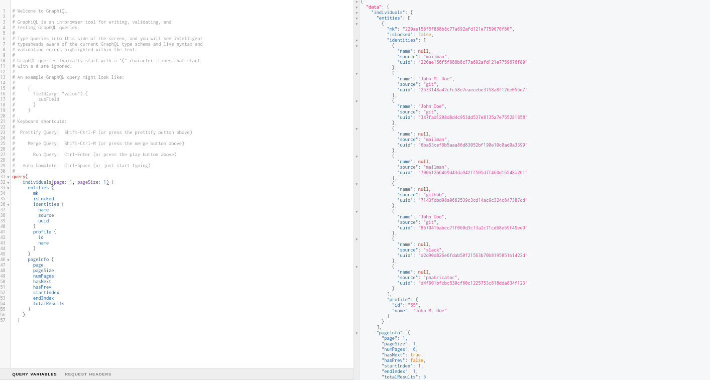

## Microtask-6

Using the SortingHat GraphQL console, create a query that fetches the data of an individual profile.

### Query to fetch individual's data

```
query GetIndividuals($page: Int!, $pageSize: Int!) {
    individuals(page: $page, pageSize: $pageSize) {
      entities {
        mk
        isLocked
        identities {
          name
          source
          uuid
        }
        profile {
          id
          name
        }
      }
      pageInfo {
        page
        pageSize
        numPages
        hasNext
        hasPrev
        startIndex
        endIndex
        totalResults
      }
    }
  }
```

### Image of executed query


