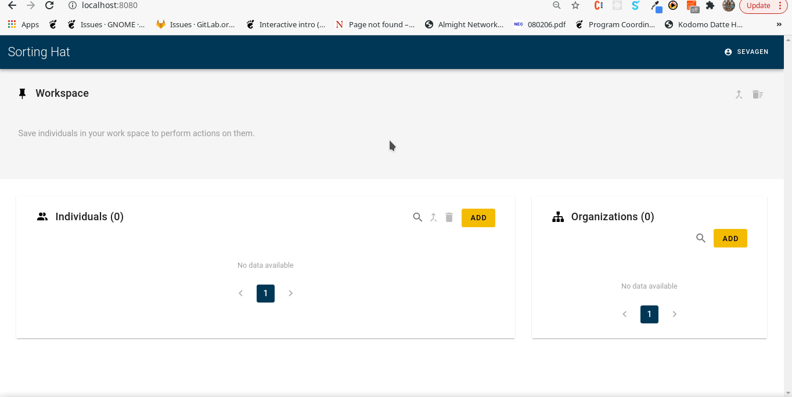

## Microtask-7

Create a script that can parse gitdm developer affiliation files and load the data in a SortingHat database using GraphQL  

The developer affiliation files available in the gitdm repository are in a .txt format which makes it difficult to retrieve specific information. However all the content in the affiliation text files are provided in JSON format [here](https://github.com/cncf/devstats/blob/master/github_users.json) 
Using the JSON file, I was able to make a script that filters out the required attributes(name, email, source etc...) and parse them onto a GraphQL query. The Fetch API is used to make the request.  

### Steps

1. Run <code>npm install</code> to install the dependencies
2. Run <code>node gitdm_script.js</code> to run the file.

The query used is <code>ADD_IDENTITY</code>. However, that can be swapped out with another other mutations available in <code>apollo/mutations.js</code>

Here is a small demo. The origin github_users file was way too large. I'm using the <code>github_users_test.json</code> for the demo.

